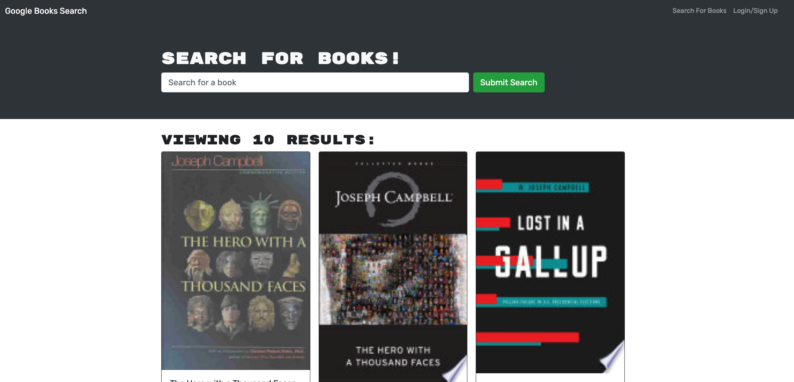

# Book Search Engine

## Description 

The Book Search Engine is a Google Books API search engine using the MERN Stack where you can search books online. You may sign up and sign in to save books to your reading wish list and remove them when you're ready to remove them. 

When you load the search engine, you'll be presented with a menu with the options Search for Books and Login/Signup and an input field to search for books and a submit button. 

You can click on the Search for Books menu option and you'll be presented with an input field to search for books and a submit button. If you're  logged in you can enter a search term in the input field and click the submit button where you'll presented with several search results, each featuring a book’s title, author, description, image, and a link to that book on the Google Books site. You can then click on the Login/Signup menu option and a modal will appear on the screen with a toggle between the option to log in or sign up. 

Once you're logged in, the menu options change to Search for Books, an option to see your saved books, and Logout. 

## Table of Contents

* [Installation](#installation)
* [License](#License) 
* [Contributing](#Contributing)
* [Tests](#Tests) 
* [Languages and Dependencies](#Languages) 

## Installation

To install, simply clone the app and git init the json packages. Once on node, you run the script 'npm start' on your terminal and the program will take you directly to the site using graphQL. 

---
## License

  The application is covered under the MIT license.

  

## Contributing

Other may contribute by requesting to contribute through GitHub, cloning the code and creating separate branches. All final code will be reviewed and approved if changes are favorable.

## Tests

N.A.

## Languages and Dependencies

JavaScript, ES6, Node.js, Apollo, Server, Express, React, Bootstrap

## For More Information

* jesusmanteca@gmail.com
* [Link to Repo](https://github.com/jesusmanteca)
* [Link to Live Site](https://dashboard.heroku.com/apps/tranquil-ravine-07521/settings)

